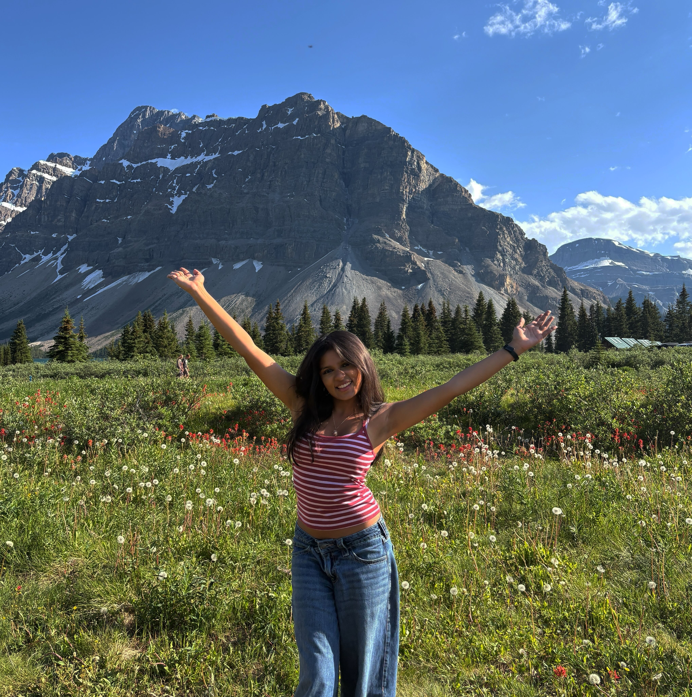

# Gaayathri Mathuria

- Hometown: Fairfax, Virginia
- Hobbies: Dance, hiking, reading, travel
- First computer I ever saw: I don't remember because I was too young, but I think my dad had a BlackBerry and my mom had an iMac desktop!
- About me: I'm a Data Science major and Computer Science minor. I'm interested in the applications of data science to healthcare and education, but still exploring where I want to take my degree. Some organizations I'm involved in include the Undergraduate Data Science Council, the Posse Foundation, Smart Woman Securities, and Humans in Control.